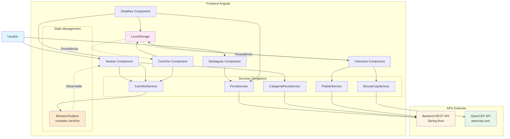
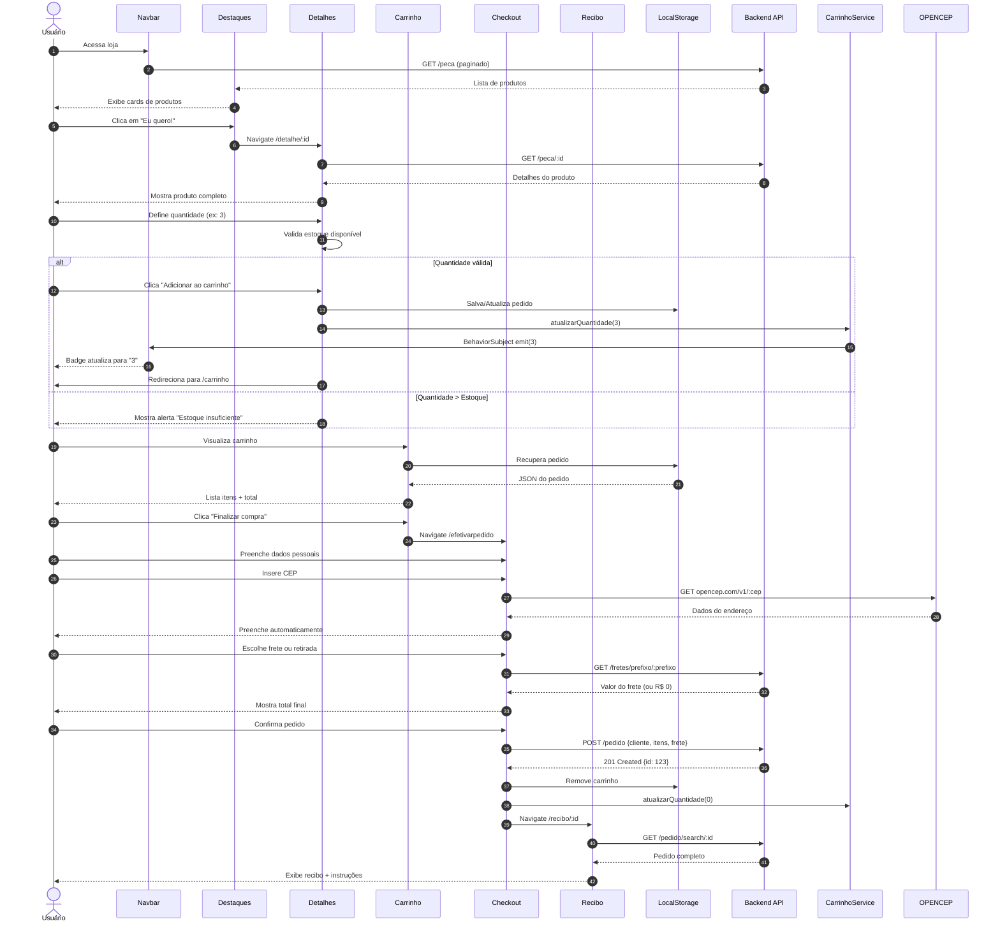

# 🛒 E-commerce Loja de Autopeças (PWA)


## 📋 Sobre o Projeto

E-commerce moderno e responsivo desenvolvido como **Progressive Web App (PWA)** para vendas online de autopeças. Interface otimizada para mobile com experiência de usuário fluida, carrinho de compras inteligente e integração completa com API REST.

### 🎯 Problema de Negócio Resolvido

Loja virtual completa que permite:
- **Navegação intuitiva** por categorias de produtos
- **Busca avançada** por palavras-chave com paginação
- **Carrinho persistente** usando LocalStorage
- **Checkout simplificado** com validação de estoque em tempo real
- **Cálculo automático de frete** por CEP (integração OpenCEP)
- **Indicadores visuais** de estoque (baixo, crítico, pronta entrega)
- **Design responsivo** otimizado para mobile-first
- **PWA instalável** para experiência nativa em qualquer dispositivo

---

## ✨ Funcionalidades Principais

### 🛍️ Catálogo de Produtos
- ✅ **Listagem paginada** de todos os produtos
- ✅ **Filtro por categoria** com navegação dinâmica
- ✅ **Busca por palavra-chave** com resultados paginados
- ✅ **Cards responsivos** adaptáveis a qualquer tela
- ✅ **Badges visuais** indicando:
  - 🟢 Pronta Entrega
  - 🟡 Estoque Baixo
  - 🔴 Estoque Crítico
- ✅ **Preços promocionais** com destaque visual
- ✅ Formatação brasileira (R$, pt-BR)

### 📦 Detalhes do Produto
- ✅ **Visualização completa** com imagem e descrição HTML
- ✅ **Validação de estoque** em tempo real
- ✅ **Seletor de quantidade** com limites dinâmicos
- ✅ **Alertas visuais** quando quantidade excede estoque
- ✅ Cálculo automático de preço (normal vs promocional)
- ✅ Botão desabilitado se quantidade inválida

### 🛒 Carrinho de Compras
- ✅ **Persistência** via LocalStorage (não perde ao fechar navegador)
- ✅ **Contador dinâmico** no ícone do carrinho (navbar)
- ✅ **Gestão completa**: adicionar, remover, visualizar
- ✅ **Cálculo automático** de subtotais e total
- ✅ **Feedback visual** com toasts ao remover itens
- ✅ **Validação** de carrinho vazio
- ✅ Layout responsivo (cards em mobile)

### 💳 Checkout e Finalização
- ✅ **Formulário de cliente** com validação
- ✅ **Busca automática de endereço** por CEP (API OpenCEP)
- ✅ **Cálculo de frete** por região/prefixo
- ✅ **Opção de retirada** no local (frete zero)
- ✅ **Recibo detalhado** após conclusão do pedido
- ✅ Envio do pedido para API REST

### 📱 PWA - Progressive Web App
- ✅ **Instalável** em qualquer dispositivo (Android, iOS, Desktop)
- ✅ **Service Worker** para cache de assets
- ✅ **Funciona offline** (assets estáticos)
- ✅ **Manifest configurado** com ícones e tema
- ✅ Estratégia de cache otimizada (app + assets)

### 🎨 Design e UX
- ✅ **Mobile-first** - otimizado para smartphones
- ✅ **Bootstrap 5.3.7** - grid system responsivo
- ✅ **Font Awesome 7** - ícones modernos
- ✅ **Gradientes customizados** em botões
- ✅ **Navegação fluida** entre páginas (SPA)
- ✅ **Toasts informativos** para feedback ao usuário

---

## 🛠️ Tecnologias Utilizadas

### Core
- **Angular 20.3.13** - Framework frontend
- **TypeScript 5.9.3** - Linguagem principal
- **RxJS 7.8** - Programação reativa (Observables)

### UI/UX
- **Bootstrap 5.3.7** - Framework CSS responsivo
- **Font Awesome 7.0.0** - Biblioteca de ícones

### PWA
- **@angular/service-worker 20.3.13** - Service Worker nativo
- **ngsw-config.json** - Configuração de cache

### Integrações
- **OpenCEP API** - Busca de endereços por CEP
- **API REST própria** - Backend Spring Boot (produtos, pedidos, categorias)

### Utilitários
- **LocalStorage** - Persistência do carrinho
- **jwt-decode 4.0.0** - (Preparado para autenticação futura)
- **Locale pt-BR** - Formatação brasileira (moeda, datas)

### Build & Dev
- **Angular CLI 20.3.13** - Tooling
- **TypeScript Compiler** - Transpilação
- **Karma + Jasmine** - Testes (configurado)

---

## 🏗️ Arquitetura da Aplicação

### Estrutura de Componentes

```
src/
├── app/
│   ├── componentes/
│   │   ├── navbar/              # Barra de navegação com busca e carrinho
│   │   ├── rodape/              # Rodapé com redes sociais
│   │   ├── carousel/            # Carrossel de destaques (opcional)
│   │   ├── destaques/           # Página inicial (produtos paginados)
│   │   ├── detalhes/            # Detalhes do produto individual
│   │   ├── buscacategoria/      # Listagem por categoria
│   │   ├── busca-palavra-chave/ # Resultados de busca
│   │   ├── carrinho/            # Carrinho de compras
│   │   ├── efetivarpedido/      # Checkout (formulário cliente + frete)
│   │   └── recibo/              # Confirmação do pedido
│   │
│   ├── servicos/                # Services Angular
│   │   ├── peca-service.ts            # API de produtos
│   │   ├── categoria-peca.ts          # API de categorias
│   │   ├── pedido-service.ts          # API de pedidos
│   │   ├── carrinho-service.ts        # Gestão de carrinho (BehaviorSubject)
│   │   ├── buscar-cep-service.ts      # Integração OpenCEP
│   │   └── buscar-produto-by-key.ts   # Comunicação entre componentes (busca)
│   │
│   ├── model/                   # Interfaces TypeScript
│   │   ├── Peca.ts
│   │   ├── Pedido.ts
│   │   ├── ItemPedido.ts
│   │   ├── Cliente.ts
│   │   ├── CategoriaPeca.ts
│   │   ├── PaginaProduto.ts
│   │   └── EntidadeCEP.ts
│   │
│   └── app.routes.ts            # Configuração de rotas
│
├── environments/                # Configurações de ambiente
│   ├── environment.ts           # Desenvolvimento (localhost:8080)
│   └── environment.prod.ts      # Produção (projetoreal.dev.br:8443)
│
├── ngsw-config.json             # Configuração do Service Worker (PWA)
├── manifest.webmanifest         # Manifest PWA
└── styles.css                   # Estilos globais

```

### Fluxo de Dados - Arquitetura Reativa



### Fluxo de Compra Completo



---

## 🔄 Gestão de Estado - CarrinhoService

### Arquitetura Reativa com BehaviorSubject

```typescript
// carrinho-service.ts
@Injectable({ providedIn: 'root' })
export class CarrinhoService {
  private numberOfItens: BehaviorSubject<number>;

  constructor() {
    // Inicializa contando itens salvos no LocalStorage
    const carrinhoString = localStorage.getItem("AdicionarCarrinho");
    let quantidade = 0;

    if (carrinhoString) {
      const pedido = JSON.parse(carrinhoString);
      quantidade = pedido.itensPedido.length;
    }

    this.numberOfItens = new BehaviorSubject<number>(quantidade);
  }

  // Observable que componentes podem assinar
  public getNumberOfItens() {
    return this.numberOfItens.asObservable();
  }

  // Atualiza e emite novo valor para todos os subscribers
  public atualizarQuantidade(qtd: number) {
    this.numberOfItens.next(qtd);
  }
}
```

**Como funciona:**
1. **Navbar** se inscreve no Observable → sempre mostra contador atualizado
2. Quando usuário adiciona produto → `atualizarQuantidade(n)` é chamado
3. BehaviorSubject **emite** novo valor automaticamente
4. Navbar **recebe** e atualiza badge em tempo real (sem reload!)

---

## 🚀 Como Executar

### Pré-requisitos

- **Node.js 18+** (recomendado 20 LTS)
- **npm 9+** ou **yarn**
- **Angular CLI 20+**
- **Backend API** rodando (veja README do backend)

### 1. Clone o Repositório

```bash
git clone https://github.com/seu-usuario/loja-autopecas-frontend.git
cd loja-autopecas-frontend
```

### 2. Instale as Dependências

```bash
npm install
```

### 3. Configure os Ambientes

**`src/environments/environment.ts` (desenvolvimento):**

```typescript
export const environment = {
  production: false,
  apiURL: "http://localhost:8080"
};
```

**`src/environments/environment.prod.ts` (produção):**

```typescript
export const environment = {
  production: true,
  apiURL: "https://projetoreal.dev.br:8443"
};
```

### 4. Execute em Desenvolvimento

```bash
npm start
# ou
ng serve
```

Acesse: `http://localhost:4200`

### 5. Build para Produção

```bash
npm run build
# ou
ng build --configuration production
```

Os arquivos gerados estarão em `dist/oficina_mecanica/browser/`

**Observações importantes:**
- ✅ Service Worker **só funciona em produção**
- ✅ PWA requer **HTTPS** (exceto localhost)
- ✅ Manifest e ícones são copiados automaticamente

---

## 🧪 Testando as Funcionalidades

### 1. **Testar Navegação**

1. Acesse `http://localhost:4200`
2. Veja produtos na página inicial (Destaques)
3. Clique em "Categorias" no menu
4. Escolha uma categoria
5. Observe a URL mudar para `/buscacategoria/:id`

### 2. **Testar Busca**

1. Digite "filtro" na barra de busca
2. Clique no ícone de lupa
3. Observe redirecionamento para `/busca`
4. Veja resultados paginados

### 3. **Testar Carrinho**

1. Clique em "Eu quero!" em qualquer produto
2. Na página de detalhes, aumente a quantidade
3. Tente exceder o estoque → veja alerta vermelho
4. Defina quantidade válida e clique "Adicionar"
5. Observe o badge do carrinho atualizar automaticamente
6. Acesse o carrinho → veja seus itens
7. Remova um item → veja toast de confirmação

### 4. **Testar Checkout**

1. No carrinho, clique "Finalizar compra"
2. Preencha nome, telefone, email
3. Digite CEP (ex: `01310-100`)
4. Observe preenchimento automático do endereço
5. Escolha "Retirar no local" ou calcule frete
6. Confirme o pedido
7. Veja recibo com número do pedido

### 5. **Testar PWA (Produção)**

```bash
# Build de produção
ng build --configuration production

# Sirva os arquivos (precisa de HTTPS em produção real)
npx http-server dist/oficina_mecanica/browser -p 8080
```

Acesse `http://localhost:8080` e:
1. Abra DevTools → Application → Service Workers
2. Confirme que `ngsw-worker.js` está ativo
3. Vá em Application → Manifest
4. Veja ícones e configurações PWA
5. No Chrome: clique no ícone de "Instalar app"

### 6. **Testar Responsividade**

1. Abra DevTools (F12)
2. Ative Device Toolbar (Ctrl+Shift+M)
3. Teste em:
   - **Mobile**: 375px (iPhone SE)
   - **Tablet**: 768px (iPad)
   - **Desktop**: 1920px

Observe:
- ✅ Cards de produtos se reorganizam (6/linha → 2/linha)
- ✅ Menu vira hambúrguer em mobile
- ✅ Carrinho vira lista vertical
- ✅ Formulário de checkout empilha campos

---

## 📊 Estrutura de Rotas

```typescript
/                              → Destaques (página inicial)
/detalhe/:id                   → Detalhes do produto
/buscacategoria/:id            → Produtos por categoria
/busca                         → Resultados de busca (keyword)
/carrinho                      → Carrinho de compras
/efetivarpedido                → Checkout (formulário)
/recibo/:id                    → Recibo do pedido finalizado
```

Todas as rotas são **públicas** (sem autenticação necessária).

---

## 🎨 Customização de Estilos

### Paleta de Cores Principal

```css
:root {
  --primary-dark: #1E3A5F;      /* Azul escuro */
  --primary-light: #233A5F;     /* Azul médio */
  --accent: #00ADB5;            /* Ciano (destaque) */
  --accent-hover: #02C2C8;      /* Ciano claro */
  --text-light: #EEEEEE;        /* Texto claro */
  --background-dark: #0F0F0F;   /* Fundo escuro */
}
```

### Botão Primary (Customizado)

```css
.btn-primary {
  background: linear-gradient(145deg, #1E3A5F, #233A5F);
  color: #EEEEEE;
  border: 2px solid #00ADB5;
  border-radius: 8px;
  padding: 12px 22px;
  font-weight: 600;
  text-transform: uppercase;
  letter-spacing: 0.8px;
  transition: all 0.3s ease;
  box-shadow: 0 4px 10px rgba(0,0,0,0.3);
}

.btn-primary:hover {
  background: linear-gradient(145deg, #00ADB5, #02C2C8);
  color: #0F0F0F;
  transform: scale(1.03);
  box-shadow: 0 6px 12px rgba(0,173,181,0.3);
}
```

### Badges de Estoque

```css
#prontaEntrega {
  background-color: #28a745; /* Verde */
}

#estoqueBaixo {
  background-color: #ffc107; /* Amarelo */
  color: #000;
}

#estoqueCritico {
  background-color: #dc3545; /* Vermelho */
}
```

---

## 🔧 Configurações PWA

### Service Worker Strategy

**`ngsw-config.json`:**

```json
{
  "$schema": "./node_modules/@angular/service-worker/config/schema.json",
  "index": "/index.html",
  "assetGroups": [
    {
      "name": "app",
      "installMode": "prefetch",  // Baixa imediatamente
      "resources": {
        "files": [
          "/favicon.ico",
          "/index.html",
          "/manifest.webmanifest",
          "/*.css",
          "/*.js"
        ]
      }
    },
    {
      "name": "assets",
      "installMode": "lazy",      // Baixa sob demanda
      "updateMode": "prefetch",
      "resources": {
        "files": [
          "/**/*.(svg|cur|jpg|jpeg|png|apng|webp|avif|gif|otf|ttf|woff|woff2)"
        ]
      }
    }
  ],
  "navigationUrls": [
    "/**",
    "!/admin",        // Exclui área administrativa
    "!/admin/**"
  ]
}
```

**Estratégias:**
- **prefetch**: Baixa durante instalação (app shell)
- **lazy**: Baixa quando necessário (imagens)
- **Cache-first**: Prioriza cache, fallback para rede

---

## 🌐 Deploy

### Deploy em Servidor (Nginx/Apache)

1. **Build de produção:**
```bash
ng build --configuration production
```

2. **Copie arquivos para o servidor:**
```bash
scp -r dist/oficina_mecanica/browser/* usuario@servidor:/var/www/projetoreal.dev.br/
```

3. **Configure Nginx:**

```nginx
server {
    listen 443 ssl http2;
    server_name projetoreal.dev.br;

    # SSL
    ssl_certificate /etc/letsencrypt/live/projetoreal.dev.br/fullchain.pem;
    ssl_certificate_key /etc/letsencrypt/live/projetoreal.dev.br/privkey.pem;

    # Root da loja
    root /var/www/projetoreal.dev.br;
    index index.html;

    # PWA - Suporte a todas as rotas Angular
    location / {
        try_files $uri $uri/ /index.html;
    }

    # Service Worker deve ter MIME type correto
    location ~ (ngsw-worker\.js|manifest\.webmanifest)$ {
        add_header Cache-Control "no-cache";
        add_header Service-Worker-Allowed "/";
    }

    # API Backend (proxy reverso)
    location /api {
        proxy_pass http://localhost:8080;
        proxy_set_header Host $host;
        proxy_set_header X-Real-IP $remote_addr;
        proxy_set_header X-Forwarded-For $proxy_add_x_forwarded_for;
        proxy_set_header X-Forwarded-Proto $scheme;
    }

    # Assets com cache longo
    location ~* \.(jpg|jpeg|png|gif|ico|css|js|woff|woff2|ttf|svg)$ {
        expires 1y;
        add_header Cache-Control "public, immutable";
    }
}

# Redirect HTTP → HTTPS
server {
    listen 80;
    server_name projetoreal.dev.br;
    return 301 https://$server_name$request_uri;
}
```

4. **Reinicie Nginx:**
```bash
sudo nginx -t
sudo systemctl reload nginx
```

### Deploy em Firebase Hosting

```bash
# Instale Firebase CLI
npm install -g firebase-tools

# Login
firebase login

# Inicialize
firebase init hosting

# Configure firebase.json
# Deploy
firebase deploy --only hosting
```

**`firebase.json`:**
```json
{
  "hosting": {
    "public": "dist/oficina_mecanica/browser",
    "ignore": ["firebase.json", "**/.*", "**/node_modules/**"],
    "rewrites": [
      {
        "source": "**",
        "destination": "/index.html"
      }
    ],
    "headers": [
      {
        "source": "ngsw-worker.js",
        "headers": [
          {
            "key": "Cache-Control",
            "value": "no-cache"
          }
        ]
      }
    ]
  }
}
```

---

## 🐛 Troubleshooting

### Problema: Service Worker não atualiza

**Solução:**
```bash
# DevTools → Application → Service Workers
# Clique em "Unregister"
# Ou force com código:
```

```typescript
// src/main.ts
if ('serviceWorker' in navigator) {
  navigator.serviceWorker.getRegistrations().then(registrations => {
    registrations.forEach(reg => reg.unregister());
  });
}
```

### Problema: Carrinho perde dados ao recarregar

**Causa:** LocalStorage não está salvando corretamente.

**Solução:**
1. Abra DevTools → Application → Local Storage
2. Confirme que existe chave `"AdicionarCarrinho"`
3. Verifique se é um JSON válido
4. Se vazio, adicione produto novamente

### Problema: API retorna CORS error

**Solução no Backend:**
```java
// MyWebApplicationSecurityConfig.java
configuration.setAllowedOrigins(Arrays.asList(
    "http://localhost:4200",
    "https://projetoreal.dev.br"
));
configuration.setAllowedMethods(Arrays.asList("GET", "POST", "PUT", "DELETE"));
```

### Problema: Busca por CEP não funciona

**Causas possíveis:**
1. CEP inválido (deve ter 8 dígitos)
2. API OpenCEP fora do ar
3. CORS bloqueado

**Solução:**
- Valide formato do CEP antes de buscar
- Adicione fallback manual se API falhar
- Teste com CEP conhecido: `01310-100` (Av. Paulista, SP)

### Problema: Imagens de produtos não carregam

**Causa:** URL incorreta ou CORS.

**Solução:**
1. Verifique se backend serve imagens corretamente
2. Confirme URL no banco: `https://projetoreal.dev.br/assets/img/produto.jpg`
3. Backend deve ter CORS habilitado para imagens

### Problema: PWA não instala

**Requisitos para PWA:**
- ✅ HTTPS habilitado (exceto localhost)
- ✅ manifest.webmanifest presente
- ✅ Service Worker registrado
- ✅ Ícones nos tamanhos corretos (192x192, 512x512)

**Verificar:**
```bash
# DevTools → Lighthouse
# Execute audit para PWA
# Veja checklist de requisitos
```

---

## 📈 Melhorias Futuras

Possíveis evoluções da loja:

- [ ] **Autenticação de usuário** (login/cadastro)
- [ ] **Histórico de pedidos** do cliente
- [ ] **Favoritos/Wishlist**
- [ ] **Comparação de produtos**
- [ ] **Avaliações e comentários**
- [ ] **Filtros avançados** (preço, marca, etc.)
- [ ] **Ordenação** (menor preço, mais vendidos)
- [ ] **Integração com gateway de pagamento** (Stripe/PagSeguro)
- [ ] **Rastreamento de pedido** em tempo real
- [ ] **Notificações push** de ofertas/promoções
- [ ] **Modo escuro**
- [ ] **Compartilhamento social** de produtos
- [ ] **Cupons de desconto**
- [ ] **Chat de suporte** (WhatsApp Web API)
- [ ] **Testes E2E** com Cypress

---

## 🔒 Segurança - Boas Práticas

### ⚠️ NUNCA Versione

Adicione ao `.gitignore`:

```
# Environments
src/environments/environment.ts
src/environments/environment.prod.ts

# Node
node_modules/
npm-debug.log
yarn-error.log

# Build
dist/
.angular/

# IDE
.vscode/
.idea/
*.swp
*.swo
```

### ✅ Use Arquivo de Exemplo

Crie `src/environments/environment.example.ts`:

```typescript
export const environment = {
  production: false,
  apiURL: "http://localhost:8080"
};
```

### 🔐 Recomendações

- ✅ Use **HTTPS** em produção (obrigatório para PWA)
- ✅ Valide **todas as entradas** do usuário
- ✅ Sanitize HTML renderizado (`[innerHTML]` com DomSanitizer)
- ✅ Configure **CSP** (Content Security Policy)
- ✅ Limite tamanho de requests
- ✅ Implemente **rate limiting** no backend
- ✅ Não armazene dados sensíveis no LocalStorage
- ✅ Use variáveis de ambiente para URLs de API

---

## 📚 Documentação Adicional

### Links Úteis

- [Angular Docs](https://angular.dev)
- [Bootstrap 5 Docs](https://getbootstrap.com/docs/5.3/)
- [Font Awesome Icons](https://fontawesome.com/icons)
- [PWA Guide](https://web.dev/progressive-web-apps/)
- [Service Worker API](https://developer.mozilla.org/en-US/docs/Web/API/Service_Worker_API)
- [OpenCEP API](https://opencep.com)

### Debugging LocalStorage

**Chrome DevTools:**
```
Application → Storage → Local Storage → http://localhost:4200
```

**Ver conteúdo do carrinho:**
```javascript
// Console do navegador
const carrinho = JSON.parse(localStorage.getItem('AdicionarCarrinho'));
console.log(carrinho);
```

**Limpar carrinho manualmente:**
```javascript
localStorage.removeItem('AdicionarCarrinho');
location.reload();
```

### PWA Debugging

**Service Worker:**
```
Application → Service Workers
```

**Cache Storage:**
```
Application → Cache Storage → ngsw:...
```

**Manifest:**
```
Application → Manifest
```

**Simular offline:**
```
Network → Throttling → Offline
```

---

## 👨‍💻 Autor

**Gabriel Núñez**

Desenvolvedor Full Stack | Angular & Spring Boot Specialist

[](https://www.linkedin.com/in/gabriel-nunez-contasti/)
[](https://github.com/gajonuco)
[](mailto:gajonuco@gmail.com)

---

## 🔗 Projetos Relacionados

Este frontend consome APIs desenvolvidas em Spring Boot:

📦 **[Backend API - Sistema E-commerce](https://github.com/gajonuco/pecasbr-api)**  
🎨 **[Painel Administrativo - PWA](https://github.com/gajonuco/pecasbr-admin)**

---

<div align="center">

**⭐ Se este projeto foi útil, considere dar uma estrela!**

**🛒 E-commerce moderno com Angular 20 e PWA**

Made with ❤️ by Gabriel Núñez

</div>
